## 👋 SK네트웍스 Family AI 캠프 26기 👋

<!--

**Here are some ideas to get you started:**

🙋‍♀️ A short introduction - what is your organization all about?
🌈 Contribution guidelines - how can the community get involved?
👩‍💻 Useful resources - where can the community find your docs? Is there anything else the community should know?
🍿 Fun facts - what does your team eat for breakfast?
🧙 Remember, you can do mighty things with the power of [Markdown](https://docs.github.com/github/writing-on-github/getting-started-with-writing-and-formatting-on-github/basic-writing-and-formatting-syntax)
-->

### [01_프로그래밍 기초 주간](https://github.com/orgs/20260120-skn-ai-camp/projects/1)

```mermaid
graph TD
    A[01_프로그래밍 기초 주간]
    A1[Python]
    A2[MySQL]
    A3[Data Collection]
    A --> A1
    A --> A2
    A --> A3

    click A "https://github.com/orgs/20260120-skn-ai-camp/projects/1" "프로그래밍 기초"
    click A1 "https://github.com/20260120-skn-ai-camp/01_python_workspace" "프로그래밍 기초 - Python"
    click A2 "https://github.com/20260120-skn-ai-camp/02_mysql_workspace" "프로그래밍 기초 - MySQL"
    click A3 "https://github.com/20260120-skn-ai-camp/03_data_collection_workspace" "프로그래밍 기초 - Data Collection"

```

